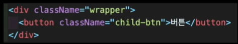
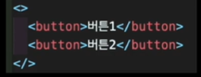
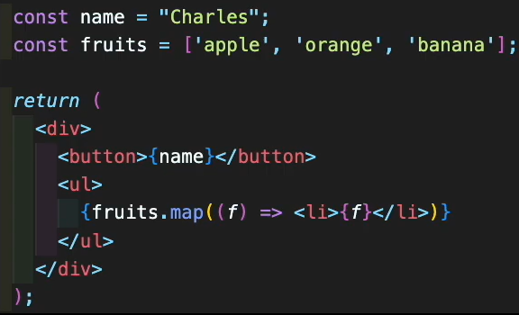

# Jsx란?

- Javascript XML의 약자

- JS에 XML을 추가한 JS 확장 문법
  - 쉽게 말해 JS 내에서 HTML문법을 사용하는 것!

Jsx 문법 형태 예

- JSX는 JS아니므로, 브라우저가 이해할 수 없음

  - 따라서, 리액트는 Babel이라는 컴파일러를 사용하여 JSX -> SJ로 변환함

    

# JSX 규칙

1. class대신 className

   

2. 무조건 하나의 부모 요소로 감싸주어야 함

   

   - div로 묶어주기 싫을 때는 빈 태그로 감싸주기

   - 빈 태그는 Fragment라고 부르며, 실제로 화면에 렌더링 되지 않음

3. JSX 내에서 JS 표현식을 사용하고 싶을 때는 중괄호 사용하기

   
